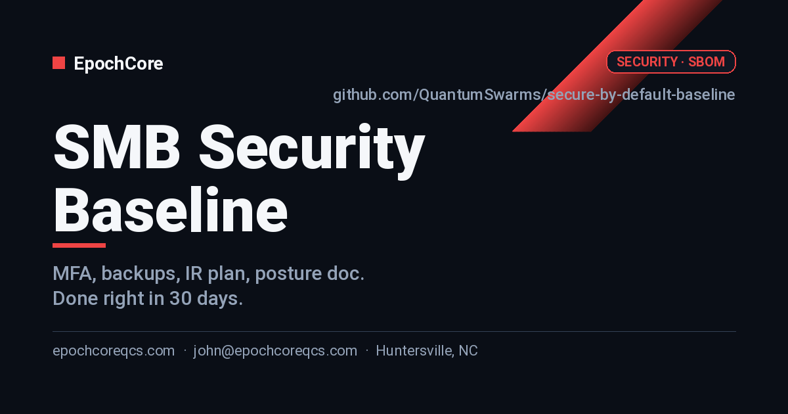

# SMB Security Baseline

> The 30-day security upgrade every SMB should have done last year. SSO, MFA, backups, incident plan — done right, documented, defensible.

---

## Who this is for

SMBs that handle customer data, take payments, or have lost sleep after a phishing scare — and any business pursuing contracts that ask for a security questionnaire.

## What you get

- MFA enforced on every business-critical account (email, banking, CRM, hosting).
- Backups that are tested, not just configured — with a restore drill on file.
- An incident response playbook your team has actually rehearsed once.
- A one-page security posture document you can hand to enterprise prospects answering questionnaires.

## Pricing

| Tier | Price | What's included |
|---|---|---|
| **Baseline** | $5,500 | MFA, password manager, backup audit, 1-page posture doc. ~3 weeks. |
| **Hardened** | $12,500 | Baseline + endpoint baseline + IR playbook + tabletop. ~5 weeks. |
| **Audit-Ready** | $25,000+ | Hardened + SOC2 / vendor questionnaire prep + 90 days of follow-up. ~10 weeks. |

> Prices are starting points. Final scope confirmed in a free 30-min discovery call. Net-15 invoicing, 50% on signing for fixed-price tiers.

See [`docs/pricing.md`](./docs/pricing.md) for full breakdown, payment terms, and FAQ.

## Engagement timeline

- **Week 1** — Inventory, MFA rollout, password manager.
- **Weeks 2–3** — Backups, endpoint baseline.
- **Week 4** — IR playbook, tabletop, posture doc, handoff.

Full engagement details in [`docs/scope.md`](./docs/scope.md) and [`docs/deliverables.md`](./docs/deliverables.md).

## How to engage

1. **Open an [Engagement Inquiry](../../issues/new?template=engagement-inquiry.yml)** — takes 2 minutes.
2. We respond within **1 business day** with a 30-min discovery call.
3. After the call, you get a written proposal in 48 hours.

Prefer email? **john@epochcoreqcs.com** with subject `[INQUIRY] secure-by-default-baseline`.

## About EpochCore

EpochCore LLC is based in **Huntersville, NC**, serving SMBs across the Charlotte / Lake Norman region (and remote nationally). Founder John has shipped infrastructure for quantum computing platforms, IBM Watson.x agents, and enterprise cloud — now bringing that engineering rigor to SMB consulting.

- 🌐 [epochcoreqcs.com](https://epochcoreqcs.com)
- 📧 john@epochcoreqcs.com
- 📍 Huntersville, NC

## Documentation

- [`docs/scope.md`](./docs/scope.md) — what's in and out per tier
- [`docs/pricing.md`](./docs/pricing.md) — full pricing, payment, FAQ
- [`docs/intake-checklist.md`](./docs/intake-checklist.md) — what we need from you at kickoff
- [`docs/deliverables.md`](./docs/deliverables.md) — concrete artifacts you receive
- [`SETUP.md`](./SETUP.md) — internal note for builders editing this repo
- [`CHANGELOG.md`](./CHANGELOG.md) — versioned changes to this offering

## License

This repository is **proprietary** and made public for marketing purposes only. See [`LICENSE`](./LICENSE).
